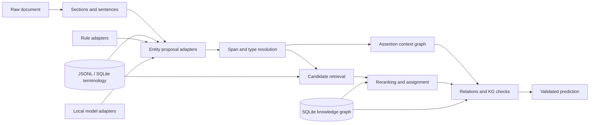

# ClinGrounder

An offset-safe clinical text grounding toolkit for extracting medical concepts, resolving clinical context,
linking terminology, and validating relation graphs. It is designed for Vietnamese and mixed
Vietnamese-English text while keeping the reusable contracts language-neutral.

ClinGrounder is a reusable Python package and research portfolio. Deterministic rules, optional
local model adapters, terminology repositories, neutral evaluation, and data-mining workflows
share typed interfaces. Historical competition code is retained as an optional benchmark plugin;
it is not part of the default runtime or evaluation path.

The PyPI distribution is named `clingrounder`; the Python import namespace remains
`clingrounder`.

Current release: [`0.1.0a2`](https://pypi.org/project/clingrounder/0.1.0a2/). The project is in
alpha: the public contracts and validation invariants are useful, but APIs may still change
between minor releases.

> Research software only. It is not a medical device and must not be used as the sole basis for
> clinical decisions.

## 30-Second Quickstart

Install the small, offline Vietnamese resource pack:

```bash
python -m pip install "clingrounder[vi]"
```

Run the deterministic pipeline without a repository checkout or network access:

```python
from clingrounder import load_pipeline

with load_pipeline("vi-clinical-small", offline=True) as pipeline:
    result = pipeline(
        "Bệnh nhân không sốt. Tiền sử tăng huyết áp. Đang dùng metformin."
    )

for entity in result.entities:
    print(entity.text, entity.type.value, entity.assertion.value, entity.code)
```

Example output from the bundled pack:

```text
sốt SYMPTOM NEGATED None
tăng huyết áp DISEASE HISTORICAL I10
metformin DRUG PRESENT 6809
```

The bundled pack is intentionally small and is a runnable smoke baseline, not a complete ICD-10
or RxNorm release. Larger terminology and model artifacts are loaded explicitly through pinned
profiles. See [the v1 product scope](docs/product-scope-v1.md).

## Product Scope

ClinGrounder is for clinical NLP researchers and application developers who need inspectable raw
spans, assertion context, and terminology-linked candidates for Vietnamese or mixed
Vietnamese-English text. Stable v1 behavior is local deterministic execution, offset-safe
annotations, explicit terminology membership, and reproducible fingerprints. Dense retrieval,
transformer adapters, graph reasoning, relations, and mining are experimental extensions.

## What It Does

- Extracts diseases, symptoms, drugs, and laboratory tests/results as the stable v1 entity surface.
- Supports additional procedure, finding, anatomy, and medication-attribute annotations through
  experimental/configured components; these are not part of the small-pack promise.
- Preserves exact raw-text spans through normalization, model tokenization, and export.
- Classifies present, negated, historical, family, possible, planned, conditional, and resolved
  context when the configured context provider has evidence for the label.
- Retrieves and links type-compatible ICD-10, RxNorm, and local terminology concepts.
- Validates typed relations when the optional relation subsystem is enabled.
- Builds derived SQLite FTS5 terminology and knowledge-graph indexes from canonical JSONL; JSONL
  remains the source of truth and stale derived indexes are rejected.
- Evaluates spans, assertions, linking, relations, runtime, and error slices independently of a task.
- Mines licensed data into provenance-rich bronze, silver, gold, and challenge snapshots.

## Design Principles

1. **Raw offsets are authoritative.** Normalized text is for lookup; exported spans always address
   the original source string.
2. **Terminology constrains linking.** A code cannot be emitted unless it exists in the loaded,
   type-compatible terminology release.
3. **Composition is explicit.** `PipelineFactory` is the composition root; `PipelineRunner` owns
   orchestration and receives concrete components through ports.
4. **Rules and models are replaceable.** Deterministic baselines and local Hugging Face adapters
   implement the same contracts.
5. **Data and experiments are reproducible.** Sources, configs, model revisions, fingerprints,
   prompts, and derived artifacts have explicit provenance.
6. **Benchmarks do not define the core.** Task schemas, heuristics, exporters, and campaign records
   live below `clingrounder.benchmarks`.

## Architecture



The main dependency direction is:

```text
schema + preprocessing + terminology ports
                    ↓
              pipeline ports
                    ↓
          rule and model adapters
                    ↓
             PipelineComponents
                    ↓
              PipelineRunner

generic evaluation ← task adapter ← optional benchmark plugin
```

See [docs/architecture.md](docs/architecture.md) and
[docs/code-map.md](docs/code-map.md) for ownership and extension points.

## Source Checkout Quickstart

Python 3.11 through 3.14 is supported.

```bash
git clone https://github.com/damminhtien/clingrounder.git
cd clingrounder

uv sync --extra dev
uv run clingrounder pipeline run \
  --config configs/pipeline/clinical-baseline.yaml \
  --input data/samples/sample_notes.jsonl \
  --output outputs/sample-predictions.jsonl
```

Without `uv`:

```bash
python -m venv .venv
source .venv/bin/activate
python -m pip install -e ".[dev]"
clingrounder pipeline run \
  --config configs/pipeline/clinical-baseline.yaml \
  --input data/samples/sample_notes.jsonl \
  --output outputs/sample-predictions.jsonl
```

To install the published library without the repository's checked-in profiles and sample data:

```bash
python -m pip install clingrounder
```

Applications should pass an explicit, application-owned profile with
`Pipeline.from_config(...)` when running from the installed wheel.

The sample emits source-backed entities such as:

```json
{
  "id": "E6",
  "text": "viêm phổi",
  "span": [102, 111],
  "type": "DISEASE",
  "assertion": "POSSIBLE",
  "code_system": "ICD-10",
  "code": "J18.9",
  "candidates": [{"concept_id": "ICD10:J18.9", "qualified": true}]
}
```

Predictions are JSONL records with document metadata, entities, candidates, relations, and
validation-oriented evidence. The exact internal schema is defined in
[`src/clingrounder/schema`](src/clingrounder/schema) and may be stricter than this abbreviated
example.

Validate and evaluate the result:

```bash
uv run clingrounder validate \
  --profile development \
  --pred outputs/sample-predictions.jsonl \
  --documents data/samples/sample_notes.jsonl \
  --dictionary data/dictionaries/seed_concepts.jsonl

uv run clingrounder evaluate \
  --gold data/samples/gold.jsonl \
  --pred outputs/sample-predictions.jsonl \
  --error-analysis outputs/sample-errors.json
```

The installed CLI is split by responsibility: `clingrounder` exposes operational commands,
`clingrounder-research` exposes mining/model commands, and `clingrounder-benchmark` loads optional
benchmark plugins. They share one dispatcher and handler registry; no command implementation is
duplicated. See [docs/cli-scopes.md](docs/cli-scopes.md).

### Python API

```python
from clingrounder import Pipeline

with Pipeline.from_config("configs/pipeline/clinical-baseline.yaml") as pipeline:
    prediction = pipeline.predict(
        "Bệnh nhân khó thở, không sốt.",
        document_id="note-001",
    )

for entity in prediction.entities:
    print(entity.text, entity.type.value, entity.assertion.value, entity.code)
```

The facade also provides `predict_document`, `predict_many`, and `predict_with_trace`. It owns
terminology repositories, model adapters, caches, and worker resources and closes them when the
context exits. `Pipeline.from_profile("clinical-baseline")` is a repository convenience for
checked-in profiles; use `Pipeline.from_config(path)` for installed-package or application-owned
profiles.

### Advanced composition

Library and research integrations can compose the lower-level runtime explicitly:

```python
from clingrounder.pipeline import PipelineComponents, PipelineFactory, PipelineRunner

components = PipelineComponents(...)  # inject ports and repositories explicitly
runner = PipelineRunner(components)
prediction = runner.process_text("note-001", "Bệnh nhân khó thở, không sốt.")
```

`PipelineFactory` remains the composition root for advanced integrations. Public ports include
`EntityExtractorPort`, `AssertionClassifierPort`, `CandidateRetrieverPort`,
`CandidateRerankerPort`, `RelationExtractorPort`, and `TerminologyRepository`; ordinary
application code should use `Pipeline` instead.

## Pipeline Profiles

Reusable profiles are explicit, path-stable YAML contracts:

| Profile | Purpose |
| --- | --- |
| `configs/pipeline/clinical-baseline.yaml` | Small deterministic quickstart |
| `configs/pipeline/full_terminology.yaml` | Full ICD-10/RxNorm normalization through SQLite |
| `configs/pipeline/full_terminology_kg_exact.yaml` | Full terminology plus exact graph evidence |
| `configs/pipeline/general_terminology_vn.yaml` | Experimental Vietnamese terminology profile |
| `configs/pipeline/mined_vietbioner_silver.yaml` | Reviewed mined Vietnamese recognition overlay |

`clingrounder pipeline run` has no hidden default profile. Model profiles must pin `model_id` and
`revision`; model adapters are lazy and local-only by default. Install the `ml` extra only when
using model-backed profiles.

The default quickstart uses only the small dictionaries committed to this repository. Full ICD-10,
RxNorm, ontology, graph, and model artifacts are not bundled in the wheel; acquire them through a
documented, license-aware workflow and record their fingerprints in the profile or release
manifest.

### Optional extras

| Extra | Use |
| --- | --- |
| `dev` | Ruff, mypy, pytest, and pre-commit |
| `vi` | Bundled offline Vietnamese quickstart pack |
| `data` | Parquet/DuckDB/S3-backed mining workflows |
| `retrieval` | BM25, character retrieval, and FAISS support |
| `ml` | Local Hugging Face training and inference |
| `graph` | NetworkX graph utilities |
| `cli` | Richer terminal output and CLI integrations |
| `api` | Optional FastAPI/ASGI integration |
| `experiment` | Optional experiment tracking/configuration tools |

Install only the capabilities needed by an application, for example:

```bash
uv pip install "clingrounder[retrieval,ml]"
```

## Terminology At Scale

Canonical terminology remains JSONL. Runtime lookup uses a derived, content-addressed SQLite FTS5
index with read-only, query-only, thread-local connections.

```bash
uv run clingrounder terminology build \
  --source data/dictionaries/seed_concepts.jsonl \
  --alias-overlay data/dictionaries/vietnamese_medical_alias.jsonl \
  --cache-dir .cache/clingrounder/terminology

uv run clingrounder terminology inspect \
  --index .cache/clingrounder/terminology/<fingerprint>.sqlite3 \
  --query metformin \
  --entity-type DRUG \
  --code-system RxNorm
```

The index rejects stale source, schema, normalization, or alias fingerprints. Exact, abbreviation,
lexical, BM25, optional dense, and graph-backed retrievers merge behind one retrieval pipeline;
type and code-system filtering remains mandatory before assignment. The seed dictionary is a
portable example, not a complete medical terminology release.

## Research Portfolio

The repository includes several independently testable research tracks. Some are stable runtime
components; model training, dense retrieval, graph evidence, and mining remain optional research
workflows:

- **Proposal-first NER:** dictionary, medication, lab, boundary, transformer, and generative
  adapters produce immutable evidence before global overlap resolution.
- **Structured medication linking:** drug name, strength, administered dose, form, route,
  frequency, release, and brand are represented separately for RxNorm compatibility checks.
- **Context reasoning:** assertion cues become a modifier-target graph with explicit scope,
  termination, priority, and provenance.
- **Hybrid retrieval:** lexical and optional dense retrieval are separated from candidate
  qualification, reranking, and final assignment.
- **Graph evidence:** exact linked concepts can provide bounded second-pass evidence without
  introducing new candidates.
- **Data mining:** source connectors, immutable artifacts, parsers, deduplication, proposal
  labeling, review queues, coverage planning, and provenance-aware snapshots are reproducible
  stages. Access and license policy is checked before acquisition.

Start with [docs/rule-ner.md](docs/rule-ner.md),
[docs/reference-implementations.md](docs/reference-implementations.md),
[docs/data-mining.md](docs/data-mining.md), and
[docs/mining-reproducibility.md](docs/mining-reproducibility.md).

## Data Mining And Provenance

```bash
uv run clingrounder-research data registry validate \
  --registry data/sources/mining_registry.yaml
uv run clingrounder-research data run --plan configs/mining/open_corpus_v1.yaml
uv run clingrounder-research data coverage report --help
uv run clingrounder-research data snapshot freeze --help
```

The public Git tree contains code, redistributable fixtures, policies, source dossiers, checksums,
and rebuild instructions. Restricted clinical text, licensed terminology, manual labels,
checkpoints, and generated runs remain in local or object storage. Their identities are recorded
in `data/provenance/local-artifacts.json` and source-specific manifests.

Audit the publication boundary before release:

```bash
uv run clingrounder release audit \
  --policy configs/repository/public-release.yaml \
  --root .
```

See [docs/public-release.md](docs/public-release.md) for restore and publication rules.

## Public Product Benchmark

The product benchmark is independent from the archived competition plugin:

```bash
clingrounder-benchmark run \
  --benchmark benchmarks/vi_clinical_grounding_v1 \
  --config configs/benchmarks/vi_clinical_grounding_v1/full.yaml \
  --output artifacts/benchmarks/vi-clinical-grounding-v1/full
```

It writes `summary.json`, `predictions.jsonl`, `errors.json`, `runtime.json`, a confusion matrix,
and a Markdown report. The checked-in dataset is a synthetic pilot; measured values must not be
described as clinical validation. See [benchmark methodology](docs/benchmarks/vi_clinical_grounding_v1/methodology.md).

Measured pilot snapshot (3 synthetic test documents, one macOS run; latency is not a hardware
benchmark):

| System | Entity exact F1 | Assertion macro-F1 | Recall@5 | Top-1 | Relation F1 | p95 ms |
| --- | ---: | ---: | ---: | ---: | ---: | ---: |
| Exact dictionary | 1.0000 | 1.0000 | 1.0000 | 1.0000 | N/A* | 17.97 |
| Lexical | 1.0000 | 1.0000 | 1.0000 | 1.0000 | N/A* | 15.52 |
| Hybrid | 1.0000 | 1.0000 | 1.0000 | 1.0000 | N/A* | 14.78 |
| Full deterministic | 1.0000 | 1.0000 | 1.0000 | 1.0000 | N/A* | 16.12 |

\* The pilot contains no gold relations, so relation F1 is not estimable. The identical
correctness scores are an expected limitation of this tiny smoke fixture, not evidence that the
systems are equivalent on clinical data. Re-run the command above to regenerate fingerprints and
machine-specific runtime values.

## Optional Demo

An inspectable local UI is available as an example, without adding a web framework to the core
package:

```bash
python -m venv .venv-demo
.venv-demo/bin/pip install -e "[vi]"
.venv-demo/bin/pip install -r examples/demo/requirements.txt
.venv-demo/bin/streamlit run examples/demo/app.py
```

See [the demo README](examples/demo/README.md). The demo is for research inspection only and does
not provide clinical decision support, PHI controls, or regulatory compliance.

## Optional Benchmark Plugin

The archived Vietnamese extraction challenge is retained for reproducibility and regression
research. It is isolated from reusable pipeline defaults and has no stability guarantee:

```bash
uv run clingrounder-benchmark list
uv run clingrounder-benchmark phase1 --help
uv run pytest -o addopts='' -m "benchmark and not private and not model" \
  tests/benchmarks/phase1
```

Task configs are under [`configs/benchmarks/phase1`](configs/benchmarks/phase1/README.md). Restricted
corpora and historical artifacts are restored by fingerprint and are not required for the toolkit
quickstart.

The benchmark plugin is intentionally not part of the reusable API contract. It is retained for
research reproducibility and may depend on private inputs or task-specific schemas.

## Scope And Limitations

- The core package is a research toolkit, not a clinical decision-support product or a regulatory
  compliance implementation.
- Rules are deterministic baselines; local model adapters are optional and require pinned weights.
  Hosted model APIs are not required by the core runtime.
- Terminology linking is only as complete as the configured release. Unknown, stale, or
  type-incompatible codes are rejected by the appropriate validation profile.
- Licensed or private clinical text is never assumed to be redistributable. Only manifests,
  fingerprints, policies, and reproducible acquisition instructions belong in the public tree.
- Default traces and logs are text-free, but deployment owners remain responsible for access
  control, retention, encryption, and organizational privacy requirements.

See [the security threat model](docs/security-threat-model.md) and
[the public release policy](docs/public-release.md) before using non-public data.

## Repository Map

```text
src/clingrounder/
  pipeline/       ports, composition, runner, tracing, parallel batches
  ner/            proposal-first rules and structured span extractors
  adapters/       rule, hybrid, Hugging Face, and generative adapters
  context/        assertion cues, scope, and modifier graphs
  terminology/    repository contract and SQLite FTS5 backend
  retrieval/      retriever adapters and evidence fusion
  linking/        qualification, reranking, and assignment
  relations/      typed relation extraction
  kg/             graph storage, reasoning, and validation
  evaluation/     task-neutral metrics and reports
  mining/         source-to-snapshot data workflows
  benchmarks/     optional task plugins
configs/
  pipeline/       reusable runtime profiles
  mining/         source and curation plans
  benchmarks/     archived task profiles
tests/
  benchmarks/     opt-in benchmark suites
```

## Development

```bash
# Default unit and contract suite; slow tiers are excluded by pytest configuration
uv run pytest tests

# All redistributable tests, including opt-in integration/release checks
uv run pytest -o addopts='' -m "not private and not model" tests

# Static checks
uv run ruff check .
uv run mypy src
```

Optional markers are `integration`, `release`, `benchmark`, `private`, and `model`. Runtime varies
with the machine and installed extras. Tests touching schema, offsets, code systems, relation
endpoints, or evidence spans remain hard gates.

## Documentation

- [Changelog](CHANGELOG.md)
- [Architecture](docs/architecture.md)
- [Code map and search recipes](docs/code-map.md)
- [API stability](docs/api-stability.md)
- [CLI scopes](docs/cli-scopes.md)
- [Schema](docs/schema.md)
- [Invariants](docs/invariants.md)
- [Evaluation](docs/evaluation.md)
- [Dictionary and terminology lifecycle](docs/dictionaries.md)
- [Data mining](docs/data-mining.md)
- [Public release policy](docs/public-release.md)
- [Release and deployment](docs/release-process.md)
- [Contributor workflow](docs/hacking.md)

Licensed under the [MIT License](LICENSE).
