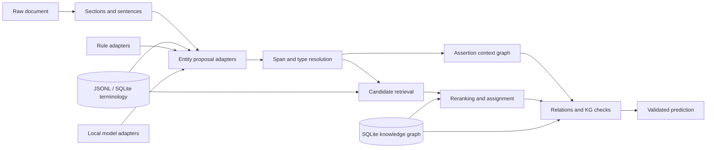

# Medical KG NLP

An offset-safe clinical NLP toolkit for extracting medical concepts, resolving clinical context,
linking terminology, and validating relation graphs. It is designed for Vietnamese and mixed
Vietnamese-English text while keeping the reusable contracts language-neutral.

The project is a reusable Python package and research portfolio. Deterministic rules, optional
local model adapters, terminology repositories, neutral evaluation, and data-mining workflows
share typed interfaces. Historical competition code is retained as an optional benchmark plugin;
it is not part of the default runtime or evaluation path.

> Research software only. It is not a medical device and must not be used as the sole basis for
> clinical decisions.

## What It Does

- Extracts diseases, symptoms, drugs, laboratory tests/results, procedures, findings, anatomy,
  and structured medication attributes such as strength, route, frequency, and duration.
- Preserves exact raw-text spans through normalization, model tokenization, and export.
- Classifies present, negated, historical, family, possible, planned, conditional, and resolved
  context when the configured context provider has evidence for the label.
- Retrieves and links type-compatible ICD-10, RxNorm, and local terminology concepts.
- Extracts typed relations and rejects invalid medical graph edges.
- Builds derived SQLite FTS5 terminology and knowledge-graph indexes from canonical JSONL; JSONL
  remains the source of truth and stale derived indexes are rejected.
- Evaluates spans, assertions, linking, relations, runtime, and error slices independently of a task.
- Mines licensed data into provenance-rich bronze, silver, gold, and challenge snapshots.

## Design Principles

1. **Raw offsets are authoritative.** Normalized text is for lookup; exported spans always address
   the original source string.
2. **Terminology constrains linking.** A code cannot be emitted unless it exists in the loaded,
   type-compatible terminology release.
3. **Composition is explicit.** `PipelineFactory` is the composition root; `PipelineRunner` owns
   orchestration and receives concrete components through ports.
4. **Rules and models are replaceable.** Deterministic baselines and local Hugging Face adapters
   implement the same contracts.
5. **Data and experiments are reproducible.** Sources, configs, model revisions, fingerprints,
   prompts, and derived artifacts have explicit provenance.
6. **Benchmarks do not define the core.** Task schemas, heuristics, exporters, and campaign records
   live below `medical_kg_nlp.benchmarks`.

## Architecture



The main dependency direction is:

```text
schema + preprocessing + terminology ports
                    ↓
              pipeline ports
                    ↓
          rule and model adapters
                    ↓
             PipelineComponents
                    ↓
              PipelineRunner

generic evaluation ← task adapter ← optional benchmark plugin
```

See [docs/architecture.md](docs/architecture.md) and
[docs/code-map.md](docs/code-map.md) for ownership and extension points.

## Quickstart

Python 3.11 through 3.14 is supported.

```bash
git clone https://github.com/damminhtien/ontological-reasoning-in-medical-knowledge-retrieval.git
cd ontological-reasoning-in-medical-knowledge-retrieval

uv sync --extra dev
uv run medical-kg pipeline run \
  --config configs/pipeline/clinical-baseline.yaml \
  --input data/samples/sample_notes.jsonl \
  --output outputs/sample-predictions.jsonl
```

Without `uv`:

```bash
python -m venv .venv
source .venv/bin/activate
python -m pip install -e ".[dev]"
medical-kg pipeline run \
  --config configs/pipeline/clinical-baseline.yaml \
  --input data/samples/sample_notes.jsonl \
  --output outputs/sample-predictions.jsonl
```

The sample emits source-backed entities such as:

```json
{
  "text": "viêm phổi",
  "span": [102, 111],
  "type": "DISEASE",
  "assertion": "POSSIBLE",
  "code_system": "ICD-10",
  "code": "J18.9"
}
```

Validate and evaluate the result:

```bash
uv run medical-kg validate \
  --profile development \
  --pred outputs/sample-predictions.jsonl \
  --documents data/samples/sample_notes.jsonl \
  --dictionary data/dictionaries/seed_concepts.jsonl

uv run medical-kg evaluate \
  --gold data/samples/gold.jsonl \
  --pred outputs/sample-predictions.jsonl \
  --error-analysis outputs/sample-errors.json
```

The installed CLI is split by responsibility: `medical-kg` exposes operational commands,
`medical-kg-research` exposes mining/model commands, and `medical-kg-benchmark` loads optional
benchmark plugins. They share one dispatcher and handler registry; no command implementation is
duplicated. See [docs/cli-scopes.md](docs/cli-scopes.md).

### Python API

```python
from medical_kg_nlp import Pipeline

with Pipeline.from_profile("clinical-baseline") as pipeline:
    prediction = pipeline.predict(
        "Bệnh nhân khó thở, không sốt.",
        document_id="note-001",
    )

for entity in prediction.entities:
    print(entity.text, entity.type.value, entity.assertion.value, entity.code)
```

The facade also provides `predict_document`, `predict_many`, and `predict_with_trace`. It owns
terminology repositories, model adapters, caches, and worker resources and closes them when the
context exits. Use `Pipeline.from_config(path)` for a checked-in or application-owned profile.

### Advanced composition

Library and research integrations can compose the lower-level runtime explicitly:

```python
from medical_kg_nlp.pipeline import PipelineComponents, PipelineFactory, PipelineRunner

components = PipelineComponents(...)  # inject ports and repositories explicitly
runner = PipelineRunner(components)
prediction = runner.process_text("note-001", "Bệnh nhân khó thở, không sốt.")
```

`PipelineFactory` remains the composition root for advanced integrations. Public ports include
`EntityExtractorPort`, `AssertionClassifierPort`, `CandidateRetrieverPort`,
`CandidateRerankerPort`, `RelationExtractorPort`, and `TerminologyRepository`; ordinary
application code should use `Pipeline` instead.

## Pipeline Profiles

Reusable profiles are explicit, path-stable YAML contracts:

| Profile | Purpose |
| --- | --- |
| `configs/pipeline/clinical-baseline.yaml` | Small deterministic quickstart |
| `configs/pipeline/full_terminology.yaml` | Full ICD-10/RxNorm normalization through SQLite |
| `configs/pipeline/full_terminology_kg_exact.yaml` | Full terminology plus exact graph evidence |
| `configs/pipeline/general_terminology_vn.yaml` | Experimental Vietnamese terminology profile |
| `configs/pipeline/mined_vietbioner_silver.yaml` | Reviewed mined Vietnamese recognition overlay |

`medical-kg pipeline run` has no hidden default profile. Model profiles must pin `model_id` and
`revision`; model adapters are lazy and local-only by default. Install the `ml` extra only when
using model-backed profiles.

## Terminology At Scale

Canonical terminology remains JSONL. Runtime lookup uses a derived, content-addressed SQLite FTS5
index with read-only, query-only, thread-local connections.

```bash
uv run medical-kg terminology build \
  --source data/processed/full_concepts.jsonl \
  --cache-dir .cache/medical-kg/terminology

uv run medical-kg terminology inspect \
  --index .cache/medical-kg/terminology/<fingerprint>.sqlite3 \
  --query metformin \
  --entity-type DRUG \
  --code-system RxNorm
```

The index rejects stale source, schema, normalization, or alias fingerprints. Exact, abbreviation,
lexical, BM25, optional dense, and graph-backed retrievers merge behind one retrieval pipeline;
type and code-system filtering remains mandatory before assignment.

## Research Portfolio

The repository includes several independently testable research tracks. Some are stable runtime
components; model training, dense retrieval, graph evidence, and mining remain optional research
workflows:

- **Proposal-first NER:** dictionary, medication, lab, boundary, transformer, and generative
  adapters produce immutable evidence before global overlap resolution.
- **Structured medication linking:** drug name, strength, administered dose, form, route,
  frequency, release, and brand are represented separately for RxNorm compatibility checks.
- **Context reasoning:** assertion cues become a modifier-target graph with explicit scope,
  termination, priority, and provenance.
- **Hybrid retrieval:** lexical and optional dense retrieval are separated from candidate
  qualification, reranking, and final assignment.
- **Graph evidence:** exact linked concepts can provide bounded second-pass evidence without
  introducing new candidates.
- **Data mining:** source connectors, immutable artifacts, parsers, deduplication, proposal
  labeling, review queues, coverage planning, and provenance-aware snapshots are reproducible
  stages. Access and license policy is checked before acquisition.

Start with [docs/rule-ner.md](docs/rule-ner.md),
[docs/reference-implementations.md](docs/reference-implementations.md),
[docs/data-mining.md](docs/data-mining.md), and
[docs/mining-reproducibility.md](docs/mining-reproducibility.md).

## Data Mining And Provenance

```bash
uv run medical-kg-research data registry validate \
  --registry data/sources/mining_registry.yaml
uv run medical-kg-research data run --plan configs/mining/open_corpus_v1.yaml
uv run medical-kg-research data coverage report --help
uv run medical-kg-research data snapshot freeze --help
```

The public Git tree contains code, redistributable fixtures, policies, source dossiers, checksums,
and rebuild instructions. Restricted clinical text, licensed terminology, manual labels,
checkpoints, and generated runs remain in local or object storage. Their identities are recorded
in `data/provenance/local-artifacts.json` and source-specific manifests.

Audit the publication boundary before release:

```bash
uv run medical-kg release audit \
  --policy configs/repository/public-release.yaml \
  --root .
```

See [docs/public-release.md](docs/public-release.md) for restore and publication rules.

## Optional Benchmark Plugin

The archived Vietnamese extraction challenge is retained for reproducibility and regression
research. It is isolated from reusable pipeline defaults and has no stability guarantee:

```bash
uv run medical-kg-benchmark list
uv run medical-kg-benchmark phase1 --help
uv run pytest -o addopts='' -m "benchmark and not private and not model" \
  tests/benchmarks/phase1
```

Task configs are under [`configs/benchmarks/phase1`](configs/benchmarks/phase1/README.md). Restricted
corpora and historical artifacts are restored by fingerprint and are not required for the toolkit
quickstart.

## Repository Map

```text
src/medical_kg_nlp/
  pipeline/       ports, composition, runner, tracing, parallel batches
  ner/            proposal-first rules and structured span extractors
  adapters/       rule, hybrid, Hugging Face, and generative adapters
  context/        assertion cues, scope, and modifier graphs
  terminology/    repository contract and SQLite FTS5 backend
  retrieval/      retriever adapters and evidence fusion
  linking/        qualification, reranking, and assignment
  relations/      typed relation extraction
  kg/             graph storage, reasoning, and validation
  evaluation/     task-neutral metrics and reports
  mining/         source-to-snapshot data workflows
  benchmarks/     optional task plugins
configs/
  pipeline/       reusable runtime profiles
  mining/         source and curation plans
  benchmarks/     archived task profiles
tests/
  benchmarks/     opt-in benchmark suites
```

## Development

```bash
# Fast unit and contract suite, normally under 15 seconds on the reference machine
uv run pytest tests

# All redistributable tests, including opt-in integration/release checks
uv run pytest -o addopts='' -m "not private and not model" tests

# Static checks
uv run ruff check .
uv run mypy src
```

Optional markers are `integration`, `release`, `benchmark`, `private`, and `model`. Tests touching
schema, offsets, code systems, relation endpoints, or evidence spans remain hard gates.

## Documentation

- [Architecture](docs/architecture.md)
- [Code map and search recipes](docs/code-map.md)
- [API stability](docs/api-stability.md)
- [CLI scopes](docs/cli-scopes.md)
- [Schema](docs/schema.md)
- [Invariants](docs/invariants.md)
- [Evaluation](docs/evaluation.md)
- [Dictionary and terminology lifecycle](docs/dictionaries.md)
- [Data mining](docs/data-mining.md)
- [Public release policy](docs/public-release.md)
- [Contributor workflow](docs/hacking.md)

Licensed under the [MIT License](LICENSE).
