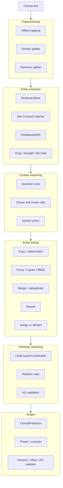
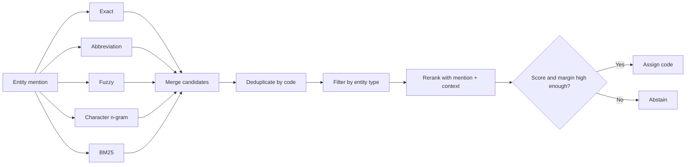

# Ontological Reasoning in Medical Knowledge Retrieval

This repository converts clinical narratives into structured medical data by:

- detecting **entities** such as diseases, symptoms, medications, and laboratory observations;
- classifying **assertions** such as present, negated, historical, family-related, or possible;
- linking entity mentions to standard terminologies such as **ICD-10** and **RxNorm**;
- validating predictions with ontology and knowledge-graph constraints;
- exporting JSON files and submission archives that follow the Phase 1 schema.

For example, the pipeline transforms:

```text
Bệnh nhân có tiền sử đái tháo đường type 2, đang dùng metformin 500 mg.
```

into structured output similar to:

```json
{
  "entities": [
    {
      "text": "đái tháo đường type 2",
      "type": "DISEASE",
      "assertion": "HISTORICAL",
      "code_system": "ICD-10",
      "code": "E11"
    },
    {
      "text": "metformin",
      "type": "DRUG",
      "assertion": "PRESENT",
      "code_system": "RxNorm",
      "code": "6809"
    }
  ]
}
```

> This is a **hybrid system** built from rule-based NER, dictionary retrieval, heuristic reranking, and ontology validation. It is not an end-to-end neural model.

Supported Python versions: **3.11–3.14**.

Vietnamese documentation: [`README_VI.md`](README_VI.md).
Package ownership and extension points: [`docs/code-map.md`](docs/code-map.md).
Breaking 0.2 migration notes: [`docs/migration-v0.2.md`](docs/migration-v0.2.md).
Rule NER architecture and measured stages: [`docs/rule-ner-v2.md`](docs/rule-ner-v2.md).
Linux/Vast.ai model handoff: [`docs/vast-ai-model-runbook.md`](docs/vast-ai-model-runbook.md).
Joint Vietnamese XLM-R DAPT: [`docs/xlmr-dapt.md`](docs/xlmr-dapt.md).

---

## What the repository provides

- Typed schemas for documents, entities, candidates, relations, and predictions.
- Offset-preserving preprocessing.
- ICD-10 and RxNorm dictionaries, Vietnamese aliases, and abbreviations.
- Exact, fuzzy, character n-gram, and BM25 retrieval.
- Rule-based NER for dictionary mentions, medications, strengths, and laboratory observations.
- Assertion states: `PRESENT`, `NEGATED`, `HISTORICAL`, `FAMILY`, `POSSIBLE`, `PLANNED`, and `RESOLVED`.
- Relation types such as `TREATS`, `HAS_DOSE`, and `SUGGESTS`.
- Ontology and KG constraints that reject invalid code systems or relations.
- Phase 1 exporters, validators, ZIP builders, evaluation tools, and error-analysis utilities.

The repository prioritizes three properties:

1. **Entity spans and offsets must be exact.**
2. **The system must not emit codes outside the configured dictionaries or from an invalid code system.**
3. **Every pipeline stage must remain inspectable and debuggable.**

---

# System architecture

## 1. End-to-end flow

```mermaid
flowchart LR
    A[Raw clinical text] --> B[Preprocessing]
    B --> C[Section + sentence splitting]
    C --> D[Entity extraction / NER]
    D --> E[Assertion classification]
    E --> F[Candidate generation]
    F --> G[Candidate reranking]
    G --> H[Code assignment or abstention]
    H --> I[Ontology / KG validation]
    I --> J[Relation extraction]
    J --> K[Internal JSON]
    K --> L[Phase 1 JSON + ZIP]
    L --> M[Validation + evaluation]
```



The central pipeline orchestration lives in:

```text
src/medical_kg_nlp/pipeline/runner.py
```

The best function to read first is:

```python
PipelineRunner.process_document_with_trace()
```

Each stage records timing and counters in `PipelineTrace`, including the number of detected entities, generated candidates, assigned codes, and validation issues.

## 2. Main components



## 3. Entity extraction

```text
Dictionary, medication, lab, and boundary sources
    ↓
Independent raw-offset EntityProposal records
    ↓
Contextual type resolution from observed evidence
    ↓
One global weighted overlap resolver
    ↓
Medication SIG decoration and offset validation
    ↓
EntityAnnotation + RuleNerTrace
```

Core implementation:

```text
src/medical_kg_nlp/ner/dictionary_matcher.py
src/medical_kg_nlp/ner/rule_ner.py
src/medical_kg_nlp/ner/rule_engine.py
src/medical_kg_nlp/ner/span_resolver.py
src/medical_kg_nlp/ner/medication_attribute_extractor.py
src/medical_kg_nlp/ner/lab_observation_extractor.py
```

Aho-Corasick efficiently locates dictionary strings. It does not understand negation, history, clinical context, or standard medical codes. Assertion classification and entity linking handle those concerns.

## 4. Assertion classification

Assertion classification determines the contextual status of an entity:

```text
"viêm phổi"                     → PRESENT
"không ghi nhận viêm phổi"      → NEGATED
"tiền sử viêm phổi"             → HISTORICAL
"cha bệnh nhân bị ung thư phổi" → FAMILY
"nghi viêm phổi"                → POSSIBLE
```

The classifier uses left and right cues, clause boundaries, scope-reset rules, and section titles. It also blocks semantic traps such as `không loại trừ`, which means “cannot rule out” rather than a true negation.

Core implementation:

```text
src/medical_kg_nlp/context/assertion.py
src/medical_kg_nlp/context/cue_loader.py
src/medical_kg_nlp/context/rules.py
```

## 5. Entity linking

Entity linking maps a mention in the clinical note to a standard concept:

```text
"đái tháo đường type 2" → ICD-10 E11
"metformin"              → RxNorm 6809
```



Default retrieval sources:

```python
("exact", "abbreviation", "fuzzy", "char_ngram", "bm25")
```

Default parameters:

```text
max_candidates       = 20
assignment_threshold = 0.75
assignment_margin    = 0.05
context_window       = 80 characters
```

A code is assigned only when the top score is sufficiently high and sufficiently separated from the second candidate. Otherwise, the system **abstains** instead of forcing an unreliable prediction.

Core implementation:

```text
src/medical_kg_nlp/retrieval/pipeline.py
src/medical_kg_nlp/terminology/sqlite_repository.py
src/medical_kg_nlp/linking/reranker.py
src/medical_kg_nlp/linking/linker.py
```

## 6. Ontology and KG validation

Validation rejects structurally invalid outputs:

```text
DRUG    → ICD-10   invalid
DISEASE → RxNorm   invalid
DRUG    → RxNorm   valid
DISEASE → ICD-10   valid
```

Core implementation:

```text
src/medical_kg_nlp/kg/constraints.py
src/medical_kg_nlp/kg/validator.py
src/medical_kg_nlp/kg/ontology_reasoner.py
```

---

# Phase 1 export policies

## `entity_only`: conservative submission mode

Pass `--assertion-policy empty --candidate-policy empty` to the Phase 1 benchmark command. This
policy:

- focuses on entity extraction;
- exports `assertions: []`;
- exports `candidates: []`;
- skips stages that do not affect the submission.

This mode prevents low-precision assertion or candidate predictions from reducing the final score.

## `full`: complete experimental pipeline

Pass `--assertion-policy pipeline --candidate-policy pipeline` to export values produced by the
configured pipeline. The internal pipeline enables:

- assertion classification;
- candidate generation;
- candidate reranking;
- confidence-based code assignment;
- entity-level KG validation.

`full` is not automatically better than `entity_only`. Measure it on reviewed local or manual gold data before using it for a submission.

---

# Quick installation

## Using `uv` — recommended

```bash
uv sync --extra dev
uv run pre-commit install
```

## Without `uv`

```bash
python -m venv .venv
source .venv/bin/activate
python -m pip install -e ".[dev]"
pre-commit install
```

Windows PowerShell:

```powershell
python -m venv .venv
.venv\Scripts\Activate.ps1
python -m pip install -e ".[dev]"
pre-commit install
```

---

# Run the sample pipeline

```bash
uv run medical-kg pipeline run \
  --input data/samples/sample_notes.jsonl \
  --output outputs/predictions.jsonl
```

Representative sample predictions include:

```text
đái tháo đường type 2 → HISTORICAL → ICD-10 E11
viêm phổi             → POSSIBLE   → ICD-10 J18.9
hen phế quản          → NEGATED    → ICD-10 J45
metformin             → PRESENT    → RxNorm 6809
ung thư phổi          → FAMILY     → ICD-10 C34
```

Run the tests:

```bash
uv run pytest tests
```

The default suite contains fast unit and contract tests. Run every public test before release with
`uv run pytest -o addopts='' tests`.

---

# Build a Phase 1 submission

```bash
uv run medical-kg benchmark phase1 submission \
  --input-dir data/raw/input \
  --output-dir outputs/phase1/current/output \
  --zip outputs/phase1/current/output.zip \
  --dictionary data/dictionaries/seed_concepts.jsonl \
  --assertion-policy empty \
  --candidate-policy empty
```

The submission builder:

1. reads `1.txt ... 100.txt`;
2. runs the pipeline;
3. writes `1.json ... 100.json`;
4. validates schema, offsets, and candidates;
5. creates the ZIP archive;
6. validates the final archive structure.

Round 2 private input is imported and audited without transferring old annotations:

```bash
uv run medical-kg benchmark phase1 round2 audit \
  --documents outputs/mining/phase1-round2-2026-07-22/documents.jsonl \
  --output-dir outputs/mining/phase1-round2-2026-07-22/audit
```

Build isolated probes around a frozen, already scored Round 2 artifact:

```bash
uv run medical-kg benchmark phase1 round2 probes \
  --documents outputs/mining/phase1-round2-2026-07-22/documents.jsonl \
  --source-archive-sha256 989d82404a9c1f3739e15d68a1e69d0f1f90d35c93c04ab0988e071fc1525545 \
  --base outputs/phase1/round2/20260725T050933Z_round2-reviewed-recognition-rxnorm-only_ee4c7a81a0/output.zip \
  --expected-base-sha256 f0bad7ce6493fa83bf70ff7ac70446c66fb328bb50730b613a6ea38c59b6d99e \
  --run-label round2-a-neg-hist
```

The command always emits an `A_NEG_HIST` ZIP and proves that entity identity and candidates remain
unchanged. Calibrated local model artifacts can be added with repeatable
`--source qwen=...` or `--source xlmr=...` arguments. A single source may add only exact,
non-overlapping proposals in question/answer or educational regions; clinical prose requires exact
agreement from at least two independent sources. For an already scored complete source projection,
`--build-full-source qwen` additionally creates a canonical ZIP, removes codes absent from the
pinned terminology, and emits its isolated A_NEG_HIST combination.

Build the five-type model dataset from only the frozen 76-document training split:

```bash
uv run medical-kg benchmark phase1 model-data build \
  --output-dir outputs/mining/model-datasets/phase1-manual-five-type-v1
```

The command excludes the 24-document holdout and all Round 2 text by contract.

Build the bounded Q&A/educational training view from that reviewed dataset:

```bash
uv run medical-kg benchmark phase1 model-data augment-regions \
  --output-dir outputs/mining/model-datasets/phase1-manual-five-type-qa-edu-v1
```

This adds discourse framing only to train records, caps synthetic records at 40%, leaves
development unchanged, and rejects Round 2/leaked/quarantined sources.

Inspect the pinned five-type XLM-R run before moving it to an authorized Linux/BF16 GPU:

```bash
uv run medical-kg model inspect-token-classifier-run \
  --config configs/benchmarks/phase1/models/phase1-five-type-xlmr-qa-edu-2026-07-26.yaml
```

After the verified `final-model/` and `run_manifest.json` return to this checkout, run development
inference and five-type threshold calibration in one command:

```bash
uv run medical-kg benchmark phase1 model-data calibrate \
  --output-dir outputs/models/phase1-five-type-calibration
```

The command rejects CPU-smoke/stale checkpoints, reads only the 16-document development split, and
writes a hashed prediction, calibration, and calibrated-pipeline bundle. It never opens holdout or
Round 2 labels.

Build isolated RxNorm abstention probes on the frozen Round 2 Qwen baseline:

```bash
uv run medical-kg benchmark phase1 round2 probes \
  --documents outputs/mining/phase1-round2-2026-07-22/documents.jsonl \
  --source-archive-sha256 989d82404a9c1f3739e15d68a1e69d0f1f90d35c93c04ab0988e071fc1525545 \
  --base outputs/phase1/round2/20260726T110342Z_round2-qwen-full-known_b6affead3c/variants/E_QWEN_FULL_KNOWN_A_NEG_HIST/output.zip \
  --expected-base-sha256 a3190e9911712b9fdeb2fac82f6747097bc28b9a59165ab73da2c94dddcee8b0 \
  --candidate-probe rx_only \
  --candidate-probe rx_unique_only \
  --candidate-probe rx_unique_keep_icd \
  --run-label round2-qwen-candidate-abstention
```

These variants preserve every entity and assertion. `C_RX_ONLY` removes diagnosis codes while
retaining existing RxNorm lists; `C_RX_UNIQUE_ONLY` additionally clears ambiguous drug lists;
`C_RX_UNIQUE_KEEP_ICD` clears only ambiguous drug lists and preserves diagnosis codes.

The complete source policy, artifact hashes, GPU handoff, and Round 2 privacy boundary are recorded
in [docs/mining-sources/phase1-round2.md](docs/mining-sources/phase1-round2.md).

---

# Evaluation

Internal JSONL evaluation:

```bash
uv run medical-kg evaluate \
  --gold data/samples/gold.jsonl \
  --pred outputs/predictions.jsonl
```

Phase 1 manual-gold evaluation:

```bash
python scripts/evaluate_phase1_manual_gold.py \
  --gold-dir data/manual_gold \
  --pred-dir outputs/phase1/<run>/phase1/output \
  --output-dir outputs/evaluation/manual_gold
```

Ablation experiments:

```bash
python scripts/run_ablation.py \
  --config configs/ablations.yaml \
  --run-root outputs/runs
```

See [`docs/evaluation.md`](docs/evaluation.md) for metric definitions and the evaluation workflow.

## Data mining

Licensed source acquisition, proposal review, coverage planning, and immutable dataset snapshots are
available through the task-neutral mining package:

```bash
export MEDICAL_KG_ARTIFACT_STORE=/Volumes/medical-kg-mining
uv run medical-kg data registry validate
uv run medical-kg data run --plan configs/mining/phase2.yaml
```

See [`docs/data-mining.md`](docs/data-mining.md) for source policy, storage, DUA isolation, review
priority, and snapshot leakage rules. [`docs/mining-sources/`](docs/mining-sources/README.md) records
the exact tranche, processing results, promotion boundary, and reproducible commands for every
source that has actually been mined.

---

# Repository structure

```text
configs/                  YAML configuration files
data/dictionaries/        Runtime dictionaries and aliases
data/standards/           Standard Phase 1 concepts
data/samples/             Small runnable examples
docs/                     Architecture, schema, invariants, and evaluation docs
scripts/                  Dataset importers and specialized experiments

src/medical_kg_nlp/
├── schema/               Internal data types
├── pipeline/             Ports, composition root, runner, parallel batch
├── adapters/             Replaceable rule and local model implementations
├── preprocessing/        Sections, sentences, normalization, offset mapping
├── dictionaries/         Canonical JSONL records and source importers
├── terminology/          Repository port and SQLite FTS5 index
├── mining/               Licensed acquisition, curation, review, and snapshots
├── ner/                  Entity extraction
├── context/              Assertion classification
├── retrieval/            Lexical/dense retriever composition
├── linking/              Reranking and code assignment
├── kg/                   Ontology and KG constraints
├── relations/            Relation extraction
├── evaluation/           Task-neutral metrics and reports
├── experiments/          Ablations, journals, and loop tooling
├── benchmarks/phase1/    Phase 1 adapter, scorer, exporter, and campaign code
├── validation/           Core/development/release validation profiles
├── cli/                  Installed medical-kg command handlers
└── utils/                I/O, hashing, logging, text utilities

tests/                    Fast contracts plus opt-in integration/release/model tiers
```

Root `scripts/` now contains dataset importers and specialized experiment utilities, not the stable
application CLI. See the [code map](docs/code-map.md) for ownership and search recipes.

---

# Recommended code-reading order

```text
1. README.md
2. docs/invariants.md
3. docs/code-map.md
4. src/medical_kg_nlp/pipeline/ports.py
5. src/medical_kg_nlp/pipeline/factory.py
6. src/medical_kg_nlp/pipeline/runner.py
7. src/medical_kg_nlp/schema/annotation.py
8. src/medical_kg_nlp/terminology/ports.py
9. src/medical_kg_nlp/retrieval/pipeline.py
10. src/medical_kg_nlp/benchmarks/phase1/phase1.py
11. tests/test_pipeline_contracts.py
```

The most useful initial breakpoint is:

```python
PipelineRunner.process_document_with_trace()
```

Trace the data in this order:

```text
text
→ dictionary matches
→ entities
→ assertion_features
→ generated_candidates
→ reranked_candidates
→ assigned code
→ Phase 1 rows
```

---

# Invariants that must not be broken

## Offsets

```python
source_text[start:end] == entity.text
```

## Code systems

```text
DISEASE → ICD-10
DRUG    → RxNorm
```

## Candidates

- Every candidate must exist in the configured dictionary.
- Candidates must be filtered by entity type.
- Rows with the same `(code_system, code)` must be deduplicated before selecting top-k results.

## Assertions

A cue from one clause must not automatically propagate to an entity in a later clause.

See [`docs/invariants.md`](docs/invariants.md) for the complete invariant set.

---

# Common commands

```bash
make lint
make type
make test
make pipeline
make validate
make evaluate
make profile
make phase1-submit
make phase1-validate
make ablation
```

Optional dependency groups:

```bash
uv sync --extra data
uv sync --extra retrieval
uv sync --extra graph
uv sync --extra ml
uv sync --extra cli
uv sync --extra api
uv sync --extra experiment
```

---

# Current limitations

- Recognition dictionaries remain reviewed subsets. `phase1_full.yaml` uses the complete processed
  RxNorm July 2026 release for normalization, while runtime TT06 recognition/linking remains
  controlled. Recognition coverage and normalization vocabulary are separate precision controls.
- Stable Phase 1 submission modes are entity-only or exact full-store linking. Historical selective
  policies remain under `configs/benchmarks/phase1/experiments/` for reproducibility and are exposed
  only through benchmark package APIs. Fuzzy, character n-gram, and BM25 remain diagnostic library
  capabilities until they pass independent accuracy and latency gates.
- Local Hugging Face NER and reranker adapters are available behind pinned, lazy-loaded model
  config. No model weights are enabled by default; entity recall and disease-versus-symptom
  ambiguity remain primarily dictionary/rule decisions until a local model passes evaluation.
- Assertion rules now execute per-rule priority and distance, but deterministic clause scope can
  still fail on long-distance or compositional semantics.
- RxNorm parsing separates product strength, administered dose, dosage form, route, and release.
  Concentration products, multi-ingredient strength alignment, and route-to-product compatibility
  still need broader reviewed regression data.
- Dense retrieval is not connected as a production candidate source. Adding ANN requires a
  versioned embedding model and recall/precision benchmark; installing a vector database alone
  does not provide dense retrieval.
- Lookup normalization is explicitly diagnostic and does not pretend to be a downstream text
  transform. NER and later stages use raw source coordinates; an end-to-end normalized-text path
  still requires mapped-span regression coverage.
- BTC sample recognition and reviewed mappings live under the Phase 1 benchmark package and are
  opt-in executable fixtures. Core NER/retrieval defaults never load them, and reproducing that
  example is not evidence of general clinical-linking performance.
- The existing manual-gold holdout has been opened during rule development. It is a frozen legacy
  regression set, not a blind policy holdout. A new independently annotated corpus is required for
  unbiased policy selection.
- The hidden Phase 1 set has no public gold labels, and candidate prevalence is known to differ from
  manual gold. Local aggregate score alone must not promote a candidate policy.

The current priority is blind evaluation data, model-backed entity proposals, calibrated candidate
abstention, and semantic regression coverage rather than adding uncalibrated retrieval sources.

---

# Related documentation

- [`docs/architecture.md`](docs/architecture.md): detailed technical architecture.
- [`docs/design.md`](docs/design.md): design decisions.
- [`docs/schema.md`](docs/schema.md): internal schemas.
- [`docs/invariants.md`](docs/invariants.md): invariants and correctness constraints.
- [`docs/dictionaries.md`](docs/dictionaries.md): dictionaries and source data.
- [`docs/evaluation.md`](docs/evaluation.md): metrics and evaluation workflow.
- [`AGENTS.md`](AGENTS.md): guidance for coding agents.

---

# Project hygiene

- License: MIT — [`LICENSE`](LICENSE).
- Contribution guide: [`CONTRIBUTING.md`](CONTRIBUTING.md).
- Security policy: [`SECURITY.md`](SECURITY.md).
- Code of conduct: [`CODE_OF_CONDUCT.md`](CODE_OF_CONDUCT.md).
- Changelog: [`CHANGELOG.md`](CHANGELOG.md).
