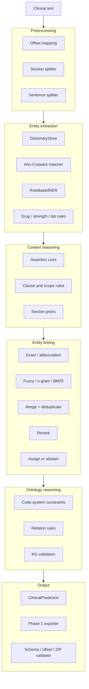
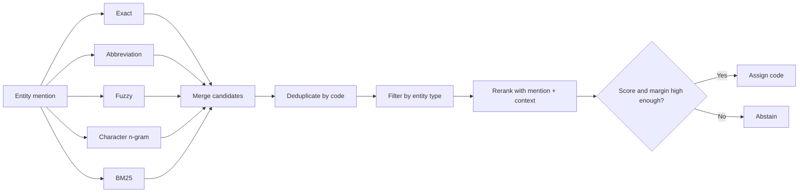

# Ontological Reasoning in Medical Knowledge Retrieval

This repository converts clinical narratives into structured medical data by:

- detecting **entities** such as diseases, symptoms, medications, and laboratory observations;
- classifying **assertions** such as present, negated, historical, family-related, or possible;
- linking entity mentions to standard terminologies such as **ICD-10** and **RxNorm**;
- validating predictions with ontology and knowledge-graph constraints;
- exporting JSON files and submission archives that follow the Phase 1 schema.

For example, the pipeline transforms:

```text
Bệnh nhân có tiền sử đái tháo đường type 2, đang dùng metformin 500 mg.
```

into structured output similar to:

```json
{
  "entities": [
    {
      "text": "đái tháo đường type 2",
      "type": "DISEASE",
      "assertion": "HISTORICAL",
      "code_system": "ICD-10",
      "code": "E11"
    },
    {
      "text": "metformin",
      "type": "DRUG",
      "assertion": "PRESENT",
      "code_system": "RxNorm",
      "code": "6809"
    }
  ]
}
```

> This is a **hybrid system** built from rule-based NER, dictionary retrieval, heuristic reranking, and ontology validation. It is not an end-to-end neural model.

Supported Python versions: **3.11–3.14**.

Vietnamese documentation: [`README_VI.md`](README_VI.md).

---

## What the repository provides

- Typed schemas for documents, entities, candidates, relations, and predictions.
- Offset-preserving preprocessing.
- ICD-10 and RxNorm dictionaries, Vietnamese aliases, and abbreviations.
- Exact, fuzzy, character n-gram, and BM25 retrieval.
- Rule-based NER for dictionary mentions, medications, strengths, and laboratory observations.
- Assertion states: `PRESENT`, `NEGATED`, `HISTORICAL`, `FAMILY`, `POSSIBLE`, `PLANNED`, and `RESOLVED`.
- Relation types such as `TREATS`, `HAS_DOSE`, and `SUGGESTS`.
- Ontology and KG constraints that reject invalid code systems or relations.
- Phase 1 exporters, validators, ZIP builders, evaluation tools, and error-analysis utilities.

The repository prioritizes three properties:

1. **Entity spans and offsets must be exact.**
2. **The system must not emit codes outside the configured dictionaries or from an invalid code system.**
3. **Every pipeline stage must remain inspectable and debuggable.**

---

# System architecture

## 1. End-to-end flow

```mermaid
flowchart LR
    A[Raw clinical text] --> B[Preprocessing]
    B --> C[Section + sentence splitting]
    C --> D[Entity extraction / NER]
    D --> E[Assertion classification]
    E --> F[Candidate generation]
    F --> G[Candidate reranking]
    G --> H[Code assignment or abstention]
    H --> I[Ontology / KG validation]
    I --> J[Relation extraction]
    J --> K[Internal JSON]
    K --> L[Phase 1 JSON + ZIP]
    L --> M[Validation + evaluation]
```



The central pipeline orchestration lives in:

```text
src/medical_kg_nlp/pipeline/runner.py
```

The best function to read first is:

```python
PipelineRunner.process_document_with_trace()
```

Each stage records timing and counters in `PipelineTrace`, including the number of detected entities, generated candidates, assigned codes, and validation issues.

## 2. Main components



## 3. Entity extraction

```text
Dictionary aliases
    ↓
Aho-Corasick scans the document
    ↓
Word-boundary validation
    ↓
Offset mapping back to the source text
    ↓
Duplicate and overlap resolution
    ↓
Additional drug, strength, and lab extraction rules
    ↓
EntityAnnotation
```

Core implementation:

```text
src/medical_kg_nlp/ner/dictionary_matcher.py
src/medical_kg_nlp/ner/rule_ner.py
src/medical_kg_nlp/ner/medication_attribute_extractor.py
src/medical_kg_nlp/ner/lab_observation_extractor.py
```

Aho-Corasick efficiently locates dictionary strings. It does not understand negation, history, clinical context, or standard medical codes. Assertion classification and entity linking handle those concerns.

## 4. Assertion classification

Assertion classification determines the contextual status of an entity:

```text
"viêm phổi"                     → PRESENT
"không ghi nhận viêm phổi"      → NEGATED
"tiền sử viêm phổi"             → HISTORICAL
"cha bệnh nhân bị ung thư phổi" → FAMILY
"nghi viêm phổi"                → POSSIBLE
```

The classifier uses left and right cues, clause boundaries, scope-reset rules, and section titles. It also blocks semantic traps such as `không loại trừ`, which means “cannot rule out” rather than a true negation.

Core implementation:

```text
src/medical_kg_nlp/context/assertion.py
src/medical_kg_nlp/context/cue_loader.py
src/medical_kg_nlp/context/rules.py
```

## 5. Entity linking

Entity linking maps a mention in the clinical note to a standard concept:

```text
"đái tháo đường type 2" → ICD-10 E11
"metformin"              → RxNorm 6809
```



Default retrieval sources:

```python
("exact", "abbreviation", "fuzzy", "char_ngram", "bm25")
```

Default parameters:

```text
max_candidates       = 20
assignment_threshold = 0.75
assignment_margin    = 0.05
context_window       = 80 characters
```

A code is assigned only when the top score is sufficiently high and sufficiently separated from the second candidate. Otherwise, the system **abstains** instead of forcing an unreliable prediction.

Core implementation:

```text
src/medical_kg_nlp/retrieval/candidate_generator.py
src/medical_kg_nlp/linking/reranker.py
src/medical_kg_nlp/linking/linker.py
```

## 6. Ontology and KG validation

Validation rejects structurally invalid outputs:

```text
DRUG    → ICD-10   invalid
DISEASE → RxNorm   invalid
DRUG    → RxNorm   valid
DISEASE → ICD-10   valid
```

Core implementation:

```text
src/medical_kg_nlp/kg/constraints.py
src/medical_kg_nlp/kg/validator.py
src/medical_kg_nlp/kg/ontology_reasoner.py
```

---

# Phase 1 operating modes

## `entity_only`: conservative submission mode

```text
configs/phase1_submission.yaml
```

The default mode:

- focuses on entity extraction;
- exports `assertions: []`;
- exports `candidates: []`;
- skips stages that do not affect the submission.

This mode prevents low-precision assertion or candidate predictions from reducing the final score.

## `full`: complete experimental pipeline

```text
configs/phase1_full.yaml
```

This mode enables:

- assertion classification;
- candidate generation;
- candidate reranking;
- confidence-based code assignment;
- entity-level KG validation.

`full` is not automatically better than `entity_only`. Measure it on reviewed local or manual gold data before using it for a submission.

---

# Quick installation

## Using `uv` — recommended

```bash
uv sync --extra dev
uv run pre-commit install
```

## Without `uv`

```bash
python -m venv .venv
source .venv/bin/activate
python -m pip install -e ".[dev]"
pre-commit install
```

Windows PowerShell:

```powershell
python -m venv .venv
.venv\Scripts\Activate.ps1
python -m pip install -e ".[dev]"
pre-commit install
```

---

# Run the sample pipeline

```bash
python scripts/run_pipeline.py \
  --input data/samples/sample_notes.jsonl \
  --output outputs/predictions.jsonl
```

Representative sample predictions include:

```text
đái tháo đường type 2 → HISTORICAL → ICD-10 E11
viêm phổi             → POSSIBLE   → ICD-10 J18.9
hen phế quản          → NEGATED    → ICD-10 J45
metformin             → PRESENT    → RxNorm 6809
ung thư phổi          → FAMILY     → ICD-10 C34
```

Run the tests:

```bash
python -m pytest tests/
```

---

# Build a Phase 1 submission

Entity-only mode:

```bash
python scripts/build_phase1_submission.py \
  --config configs/phase1_submission.yaml
```

Full pipeline:

```bash
python scripts/build_phase1_submission.py \
  --config configs/phase1_full.yaml
```

The submission builder:

1. reads `1.txt ... 100.txt`;
2. runs the pipeline;
3. writes `1.json ... 100.json`;
4. validates schema, offsets, and candidates;
5. creates the ZIP archive;
6. validates the final archive structure.

---

# Evaluation

Internal JSONL evaluation:

```bash
python scripts/evaluate.py \
  --gold data/samples/gold.jsonl \
  --pred outputs/predictions.jsonl
```

Phase 1 manual-gold evaluation:

```bash
python scripts/evaluate_phase1_manual_gold.py \
  --gold-dir data/manual_gold \
  --pred-dir outputs/phase1/<run>/phase1/output \
  --output-dir outputs/evaluation/manual_gold
```

Ablation experiments:

```bash
python scripts/run_ablation.py \
  --config configs/ablations.yaml \
  --run-root outputs/runs
```

See [`docs/evaluation.md`](docs/evaluation.md) for metric definitions and the evaluation workflow.

---

# Repository structure

```text
configs/                  YAML configuration files
data/dictionaries/        Runtime dictionaries and aliases
data/standards/           Standard Phase 1 concepts
data/samples/             Small runnable examples
docs/                     Architecture, schema, invariants, and evaluation docs
scripts/                  Command-line entry points

src/medical_kg_nlp/
├── schema/               Internal data types
├── preprocessing/        Sections, sentences, normalization, offset mapping
├── dictionaries/         ICD-10, RxNorm, aliases, abbreviations
├── ner/                  Entity extraction
├── context/              Assertion classification
├── retrieval/            Exact, fuzzy, n-gram, BM25 retrieval
├── linking/              Reranking and code assignment
├── ontology/             Phase 1-specific rules
├── kg/                   Ontology and KG constraints
├── relations/            Relation extraction
├── pipeline/             Pipeline orchestration
├── evaluation/           Metrics, error analysis, probes, ablations
└── utils/                I/O, hashing, logging, text utilities

tests/                    Unit, regression, and smoke tests
```

---

# Recommended code-reading order

```text
1. README.md
2. docs/invariants.md
3. src/medical_kg_nlp/schema/types.py
4. src/medical_kg_nlp/schema/annotation.py
5. src/medical_kg_nlp/pipeline/runner.py
6. src/medical_kg_nlp/ner/rule_ner.py
7. src/medical_kg_nlp/ner/dictionary_matcher.py
8. src/medical_kg_nlp/context/assertion.py
9. src/medical_kg_nlp/retrieval/candidate_generator.py
10. src/medical_kg_nlp/linking/reranker.py
11. src/medical_kg_nlp/linking/linker.py
12. src/medical_kg_nlp/ontology/phase1.py
13. src/medical_kg_nlp/evaluation/phase1.py
14. tests/test_pipeline_smoke.py
```

The most useful initial breakpoint is:

```python
PipelineRunner.process_document_with_trace()
```

Trace the data in this order:

```text
text
→ dictionary matches
→ entities
→ assertion_features
→ generated_candidates
→ reranked_candidates
→ assigned code
→ Phase 1 rows
```

---

# Invariants that must not be broken

## Offsets

```python
source_text[start:end] == entity.text
```

## Code systems

```text
DISEASE → ICD-10
DRUG    → RxNorm
```

## Candidates

- Every candidate must exist in the configured dictionary.
- Candidates must be filtered by entity type.
- Rows with the same `(code_system, code)` must be deduplicated before selecting top-k results.

## Assertions

A cue from one clause must not automatically propagate to an entity in a later clause.

See [`docs/invariants.md`](docs/invariants.md) for the complete invariant set.

---

# Common commands

```bash
make lint
make type
make test
make pipeline
make validate
make evaluate
make profile
make phase1-submit
make phase1-validate
make ablation
```

Optional dependency groups:

```bash
uv sync --extra data
uv sync --extra retrieval
uv sync --extra graph
uv sync --extra ml
uv sync --extra cli
uv sync --extra api
uv sync --extra experiment
```

---

# Current limitations

- Recognition dictionaries remain reviewed subsets. `phase1_full.yaml` uses the complete processed
  RxNorm July 2026 release for normalization, while runtime TT06 recognition/linking remains
  controlled. Recognition coverage and normalization vocabulary are separate precision controls.
- Active Phase 1 modes are entity-only, selective reviewed candidates, or exact full-store linking.
  Fuzzy, character n-gram, and BM25 exist as diagnostic library capabilities but have not passed
  the public/local accuracy and latency gates for submission use.
- Transformer NER, context models, and relation classifiers remain extension points. Entity recall
  and disease-versus-symptom ambiguity are still primarily dictionary/rule decisions.
- Assertion rules now execute per-rule priority and distance, but deterministic clause scope can
  still fail on long-distance or compositional semantics.
- RxNorm parsing separates product strength, administered dose, dosage form, route, and release.
  Concentration products, multi-ingredient strength alignment, and route-to-product compatibility
  still need broader reviewed regression data.
- Dense retrieval is not connected as a production candidate source. Adding ANN requires a
  versioned embedding model and recall/precision benchmark; installing a vector database alone
  does not provide dense retrieval.
- The central offset-preserving normalization stage remains diagnostic-only. Downstream modules use
  raw text and shared lookup normalization, so an end-to-end normalized-text path still requires
  mapped-span regression coverage.
- BTC sample memory and recognition overlays are benchmark-specific aids and are not evidence of
  general clinical-linking performance.
- The existing manual-gold holdout has been opened during rule development. It is a frozen legacy
  regression set, not a blind policy holdout. A new independently annotated corpus is required for
  unbiased policy selection.
- The hidden Phase 1 set has no public gold labels, and candidate prevalence is known to differ from
  manual gold. Local aggregate score alone must not promote a candidate policy.

The current priority is blind evaluation data, model-backed entity proposals, calibrated candidate
abstention, and semantic regression coverage rather than adding uncalibrated retrieval sources.

---

# Related documentation

- [`docs/architecture.md`](docs/architecture.md): detailed technical architecture.
- [`docs/design.md`](docs/design.md): design decisions.
- [`docs/schema.md`](docs/schema.md): internal schemas.
- [`docs/invariants.md`](docs/invariants.md): invariants and correctness constraints.
- [`docs/dictionaries.md`](docs/dictionaries.md): dictionaries and source data.
- [`docs/evaluation.md`](docs/evaluation.md): metrics and evaluation workflow.
- [`AGENTS.md`](AGENTS.md): guidance for coding agents.

---

# Project hygiene

- License: MIT — [`LICENSE`](LICENSE).
- Contribution guide: [`CONTRIBUTING.md`](CONTRIBUTING.md).
- Security policy: [`SECURITY.md`](SECURITY.md).
- Code of conduct: [`CODE_OF_CONDUCT.md`](CODE_OF_CONDUCT.md).
- Changelog: [`CHANGELOG.md`](CHANGELOG.md).
