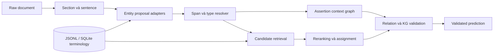

# ClinGrounder

PyPI package: `clingrounder`  · Python import: `clingrounder`

Bộ công cụ Clinical NLP bảo toàn offset để trích xuất khái niệm y khoa, phân tích ngữ cảnh,
chuẩn hóa thuật ngữ và kiểm tra đồ thị quan hệ. Repo ưu tiên tiếng Việt và văn bản trộn
Việt-Anh, nhưng các contract lõi không phụ thuộc ngôn ngữ.

Project đồng thời là thư viện có thể tái sử dụng và research portfolio. Rule engine, model local,
terminology repository, evaluation và data mining dùng chung các interface ổn định. Code của cuộc
thi cũ được giữ dưới dạng benchmark plugin tùy chọn, không được nạp bởi pipeline mặc định.

> Đây là phần mềm nghiên cứu, không phải thiết bị y tế và không được dùng làm căn cứ duy nhất cho
> quyết định lâm sàng.

## Khả Năng Chính

- Nhận diện bệnh, triệu chứng, thuốc, xét nghiệm, kết quả và thuộc tính thuốc.
- Bảo toàn chính xác `[start, end)` trên raw text qua normalization và tokenization.
- Bản stable v1 phân loại phủ định, tiền sử, gia đình, nghi ngờ và hiện tại. Các trạng thái kế
  hoạch, điều kiện và đã khỏi vẫn là experimental, chỉ dùng khi cấu hình extension tương ứng.
- Retrieval và linking ICD-10, RxNorm, terminology nội bộ theo đúng entity type.
- Trích xuất relation và chặn edge vi phạm ràng buộc y khoa.
- Xây SQLite FTS5 index bất biến từ JSONL terminology chuẩn.
- Đánh giá entity, assertion, linking, relation và runtime độc lập với từng đề thi.
- Mining dữ liệu có license, provenance, dedup, review queue và snapshot chống leakage.

## Nguyên Tắc Thiết Kế

1. Raw offset là nguồn sự thật; normalized text chỉ phục vụ lookup.
2. Không output code ngoài terminology đã load hoặc sai code system.
3. `PipelineFactory` là composition root duy nhất; runner không tự đọc config hay dựng model.
4. Rule và model là adapter có thể thay thế qua cùng một port.
5. Mọi nguồn dữ liệu, model revision và derived artifact đều có fingerprint/provenance.
6. Benchmark không được định nghĩa behavior của core toolkit.

## Kiến Trúc



Luồng dependency chính:

```text
schema + preprocessing + terminology ports
                    ↓
              pipeline ports
                    ↓
          rule và model adapters
                    ↓
             PipelineComponents
                    ↓
              PipelineRunner

generic evaluation ← task adapter ← optional benchmark plugin
```

Xem [architecture](docs/architecture.md) và [code map](docs/code-map.md) để biết ownership.

## Chạy Nhanh

Hỗ trợ Python 3.11 đến 3.14.

```bash
git clone https://github.com/damminhtien/clingrounder.git
cd clingrounder
uv sync --extra dev

uv run clingrounder pipeline run \
  --config configs/pipeline/clinical-baseline.yaml \
  --input data/samples/sample_notes.jsonl \
  --output outputs/sample-predictions.jsonl
```

Output có dạng:

```json
{
  "text": "viêm phổi",
  "span": [102, 111],
  "type": "DISEASE",
  "assertion": "POSSIBLE",
  "code_system": "ICD-10",
  "code": "J18.9"
}
```

Validate và evaluate:

```bash
uv run clingrounder validate \
  --profile development \
  --pred outputs/sample-predictions.jsonl \
  --documents data/samples/sample_notes.jsonl \
  --dictionary data/dictionaries/seed_concepts.jsonl

uv run clingrounder evaluate \
  --gold data/samples/gold.jsonl \
  --pred outputs/sample-predictions.jsonl \
  --error-analysis outputs/sample-errors.json
```

## Profile Và Extension Point

| Profile | Mục đích |
| --- | --- |
| `configs/pipeline/clinical-baseline.yaml` | Baseline deterministic nhỏ, chạy ngay |
| `configs/pipeline/full_terminology.yaml` | ICD-10/RxNorm đầy đủ qua SQLite |
| `configs/pipeline/full_terminology_kg_exact.yaml` | Terminology đầy đủ và graph evidence |
| `configs/pipeline/mined_vietbioner_silver.yaml` | Vietnamese recognition overlay đã review |

CLI không tự chọn profile ẩn. Model profile phải pin `model_id` và `revision`; adapter Hugging Face
chỉ dùng model local và lazy-load extra `ml`.

Các port công khai gồm:

- `EntityExtractorPort`
- `AssertionClassifierPort`
- `CandidateRetrieverPort`
- `CandidateRerankerPort`
- `RelationExtractorPort`
- `TerminologyRepository`

## Terminology Và Scale

JSONL là source of truth. SQLite FTS5 là index derived, content-addressed, read-only và dùng
thread-local connection.

```bash
uv run clingrounder terminology build \
  --source data/processed/full_concepts.jsonl \
  --cache-dir .cache/clingrounder/terminology

uv run clingrounder terminology inspect \
  --index .cache/clingrounder/terminology/<fingerprint>.sqlite3 \
  --query metformin \
  --entity-type DRUG \
  --code-system RxNorm
```

Exact, abbreviation, fuzzy, char n-gram, BM25, dense tùy chọn và graph retrieval đều nằm sau cùng
một retrieval pipeline. Type/code-system filter luôn chạy trước assignment.

## Các Nhánh Nghiên Cứu

- Proposal-first NER với dictionary, medication, lab, boundary, transformer và generative adapter.
- Structured RxNorm linking tách ingredient, brand, strength, dose, form, route và release.
- Assertion context graph lưu cue, scope, termination và provenance.
- Hybrid retrieval tách retrieval score, qualification và final assignment.
- Graph evidence reranker chỉ bổ sung evidence có giới hạn, không tự sinh candidate.
- Data miner từ source discovery đến snapshot, review và model dataset.

Đọc tiếp:

- [Rule NER](docs/rule-ner.md)
- [Reference implementations](docs/reference-implementations.md)
- [Data mining](docs/data-mining.md)
- [Mining reproducibility](docs/mining-reproducibility.md)

## Data Và Provenance

Public Git chỉ chứa code, fixture được phép phân phối, policy, dossier, checksum và lệnh rebuild.
Clinical text hạn chế, terminology có license, manual labels, checkpoint và generated runs vẫn được
giữ ở local/object storage. Danh tính artifact nằm trong `data/provenance/local-artifacts.json`.

```bash
uv run clingrounder release audit \
  --policy configs/repository/public-release.yaml \
  --root .
```

Xem [public release policy](docs/public-release.md).

## Benchmark Plugin Tùy Chọn

Benchmark tiếng Việt cũ được giữ để tái lập nghiên cứu:

```bash
uv run clingrounder benchmark list
uv run clingrounder benchmark phase1 --help
uv run pytest -o addopts='' -m "benchmark and not private and not model" \
  tests/benchmarks/phase1
```

Config nằm tại [`configs/benchmarks/phase1`](configs/benchmarks/phase1/README.md), tài liệu lịch sử
nằm tại [`docs/benchmarks/phase1`](docs/benchmarks/phase1/README.md). Core pipeline không tự load
resource hoặc heuristic của benchmark.

## Development

```bash
# Fast unit + contract suite
uv run pytest tests

# Toàn bộ public suite
uv run pytest -o addopts='' tests

uv run ruff check .
uv run mypy src
```

Marker tùy chọn gồm `integration`, `release`, `benchmark`, `private`, `model`. Các invariant về
schema, offset, code system và relation endpoint luôn là hard gate.

## Tài Liệu

- [Code map](docs/code-map.md)
- [Schema](docs/schema.md)
- [Invariants](docs/invariants.md)
- [Evaluation](docs/evaluation.md)
- [Dictionaries](docs/dictionaries.md)
- [Contributor workflow](docs/hacking.md)

Project sử dụng [MIT License](LICENSE).
