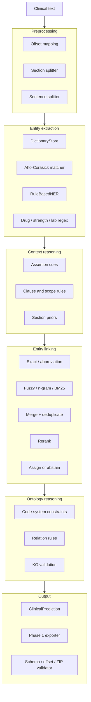

# Ontological Reasoning in Medical Knowledge Retrieval

Repo này biến văn bản bệnh án thành dữ liệu có cấu trúc:

- tìm **entity**: bệnh, triệu chứng, thuốc, xét nghiệm;
- xác định **assertion**: đang mắc, bị phủ định, thuộc tiền sử, thuộc người nhà, chỉ là nghi ngờ...;
- nối entity với mã chuẩn như **ICD-10** và **RxNorm**;
- kiểm tra kết quả bằng luật ontology/KG;
- xuất JSON và ZIP đúng schema Phase 1.

Hiểu nôm na, hệ thống đi từ:

```text
Bệnh nhân có tiền sử đái tháo đường type 2, đang dùng metformin 500 mg.
```

đến dữ liệu gần như:

```json
{
  "entities": [
    {
      "text": "đái tháo đường type 2",
      "type": "DISEASE",
      "assertion": "HISTORICAL",
      "code_system": "ICD-10",
      "code": "E11"
    },
    {
      "text": "metformin",
      "type": "DRUG",
      "assertion": "PRESENT",
      "code_system": "RxNorm",
      "code": "6809"
    }
  ]
}
```

> Đây là hệ thống **hybrid**: rule-based NER + dictionary retrieval + heuristic reranking + ontology validation. Nó chưa phải một neural model end-to-end.

Python hỗ trợ: **3.11–3.14**.

---

## Repo đang làm được gì?

- Typed schema cho document, entity, candidate, relation và prediction.
- Preprocessing giữ đúng offset gốc.
- Dictionary ICD-10, RxNorm, alias tiếng Việt và abbreviation.
- Exact, fuzzy, character n-gram và BM25 retrieval.
- Rule-based NER dựa trên dictionary, thuốc, liều dùng và xét nghiệm.
- Assertion: `PRESENT`, `NEGATED`, `HISTORICAL`, `FAMILY`, `POSSIBLE`, `PLANNED`, `RESOLVED`.
- Relation: `TREATS`, `HAS_DOSE`, `SUGGESTS` và một số quan hệ nội bộ khác.
- Ontology/KG constraints để chặn code system hoặc relation không hợp lệ.
- Phase 1 exporter, validator, ZIP builder, evaluation và error analysis.

Ba ưu tiên chính của repo:

1. **Span và offset phải đúng tuyệt đối**.
2. **Không sinh mã ngoài dictionary hoặc sai code system**.
3. **Mỗi bước phải debug được**.

---

# Kiến trúc mô hình

## 1. Luồng tổng thể

```mermaid
flowchart LR
    A[Raw clinical text] --> B[Preprocessing]
    B --> C[Section + sentence splitting]
    C --> D[Entity extraction / NER]
    D --> E[Assertion classification]
    E --> F[Candidate generation]
    F --> G[Candidate reranking]
    G --> H[Code assignment or abstention]
    H --> I[Ontology / KG validation]
    I --> J[Relation extraction]
    J --> K[Internal JSON]
    K --> L[Phase 1 JSON + ZIP]
    L --> M[Validation + evaluation]
```



Xương sống của pipeline nằm ở:

```text
src/medical_kg_nlp/pipeline/runner.py
```

Hàm nên đọc đầu tiên:

```python
PipelineRunner.process_document_with_trace()
```

Mỗi stage ghi timing và counter vào `PipelineTrace`, nên có thể biết stage nào chậm, tìm được bao nhiêu entity, sinh bao nhiêu candidate và gán được bao nhiêu code.

## 2. Các khối chính



## 3. Entity extraction

```text
Dictionary aliases
    ↓
Aho-Corasick quét văn bản
    ↓
Kiểm tra word boundary
    ↓
Map offset về source text
    ↓
Giải quyết duplicate / overlap
    ↓
Bổ sung entity từ regex thuốc, strength và lab
    ↓
EntityAnnotation
```

Code chính:

```text
src/medical_kg_nlp/ner/dictionary_matcher.py
src/medical_kg_nlp/ner/rule_ner.py
src/medical_kg_nlp/ner/medication_attribute_extractor.py
src/medical_kg_nlp/ner/lab_observation_extractor.py
```

Aho-Corasick chỉ tìm chuỗi từ dictionary. Nó không hiểu phủ định, tiền sử hay mã chuẩn. Assertion và entity linking xử lý các phần đó.

## 4. Assertion

Assertion trả lời: entity này đang ở trạng thái nào?

```text
"viêm phổi"                     → PRESENT
"không ghi nhận viêm phổi"      → NEGATED
"tiền sử viêm phổi"             → HISTORICAL
"cha bệnh nhân bị ung thư phổi" → FAMILY
"nghi viêm phổi"                → POSSIBLE
```

Classifier dùng cue trái/phải, clause boundary, scope reset và section title. Nó cũng chặn các trường hợp dễ hiểu sai như `không loại trừ`.

Code chính:

```text
src/medical_kg_nlp/context/assertion.py
src/medical_kg_nlp/context/cue_loader.py
src/medical_kg_nlp/context/rules.py
```

## 5. Entity linking

Entity linking nối mention trong bệnh án với concept chuẩn:

```text
"đái tháo đường type 2" → ICD-10 E11
"metformin"              → RxNorm 6809
```



```mermaid
flowchart LR
    A[Entity mention] --> B[Exact]
    A --> C[Abbreviation]
    A --> D[Fuzzy]
    A --> E[Character n-gram]
    A --> F[BM25]
    B --> G[Merge candidates]
    C --> G
    D --> G
    E --> G
    F --> G
    G --> H[Deduplicate by code]
    H --> I[Filter by entity type]
    I --> J[Rerank with mention + context]
    J --> K{Score and margin<br/>đủ tin cậy?}
    K -->|Có| L[Assign code]
    K -->|Không| M[Abstain]
```

Retrieval source mặc định:

```python
("exact", "abbreviation", "fuzzy", "char_ngram", "bm25")
```

Tham số mặc định:

```text
max_candidates       = 20
assignment_threshold = 0.75
assignment_margin    = 0.05
context_window       = 80 ký tự
```

Code chỉ được gán khi top score đủ cao và đủ cách biệt với candidate thứ hai. Nếu chưa đủ chắc chắn, hệ thống **abstain** thay vì cố đoán.

Code chính:

```text
src/medical_kg_nlp/retrieval/pipeline.py
src/medical_kg_nlp/terminology/sqlite_repository.py
src/medical_kg_nlp/linking/reranker.py
src/medical_kg_nlp/linking/linker.py
```

## 6. Ontology/KG validation

Validation chặn các output vô lý:

```text
DRUG    → ICD-10   ❌
DISEASE → RxNorm   ❌
DRUG    → RxNorm   ✅
DISEASE → ICD-10   ✅
```

Code chính:

```text
src/medical_kg_nlp/kg/constraints.py
src/medical_kg_nlp/kg/validator.py
src/medical_kg_nlp/kg/ontology_reasoner.py
```

---

# Hai chế độ Phase 1

## `entity_only`: submission ổn định

```text
configs/phase1_submission.yaml
```

Chế độ mặc định này:

- chỉ tập trung vào entity extraction;
- xuất `assertions: []`;
- xuất `candidates: []`;
- không dựng các stage không ảnh hưởng tới submission.

Mục tiêu là tránh để assertion hoặc candidate chưa đủ precision làm giảm điểm.

## `full`: thử nghiệm đầy đủ

```text
configs/phase1_full.yaml
```

Chế độ này bật:

- assertion classification;
- candidate generation;
- candidate reranking;
- confidence-based assignment;
- entity KG validation.

`full` không mặc nhiên tốt hơn `entity_only`; phải đo trên local/manual gold trước khi dùng cho submission.

---

# Cài đặt nhanh

## Dùng `uv` — khuyến nghị

```bash
uv sync --extra dev
uv run pre-commit install
```

## Không dùng `uv`

```bash
python -m venv .venv
source .venv/bin/activate
python -m pip install -e ".[dev]"
pre-commit install
```

Windows PowerShell:

```powershell
python -m venv .venv
.venv\Scripts\Activate.ps1
python -m pip install -e ".[dev]"
pre-commit install
```

---

# Chạy thử

```bash
python scripts/run_pipeline.py \
  --input data/samples/sample_notes.jsonl \
  --output outputs/predictions.jsonl
```

Sample hiện cho ra các entity tiêu biểu:

```text
đái tháo đường type 2 → HISTORICAL → ICD-10 E11
viêm phổi             → POSSIBLE   → ICD-10 J18.9
hen phế quản          → NEGATED    → ICD-10 J45
metformin             → PRESENT    → RxNorm 6809
ung thư phổi          → FAMILY     → ICD-10 C34
```

Chạy test:

```bash
python -m pytest tests/
```

---

# Build submission Phase 1

Entity-only:

```bash
python scripts/build_phase1_submission.py \
  --config configs/phase1_submission.yaml
```

Full pipeline:

```bash
python scripts/build_phase1_submission.py \
  --config configs/phase1_full.yaml
```

Script sẽ:

1. đọc `1.txt ... 100.txt`;
2. chạy pipeline;
3. xuất `1.json ... 100.json`;
4. kiểm tra schema, offset và candidate;
5. tạo ZIP;
6. kiểm tra cấu trúc ZIP.

Các run dùng `--run-root` được ghi vào thư mục có timestamp và content hash, kèm `run_manifest.json` để lưu config, input hash, Git state, Python version và command đã chạy.

---

# Đánh giá

Internal JSONL:

```bash
python scripts/evaluate.py \
  --gold data/samples/gold.jsonl \
  --pred outputs/predictions.jsonl
```

Phase 1 manual gold:

```bash
python scripts/evaluate_phase1_manual_gold.py \
  --gold-dir data/manual_gold \
  --pred-dir outputs/phase1/<run>/phase1/output \
  --output-dir outputs/evaluation/manual_gold
```

Ablation:

```bash
python scripts/run_ablation.py \
  --config configs/ablations.yaml \
  --run-root outputs/runs
```

Chi tiết: [`docs/evaluation.md`](docs/evaluation.md).

---

# Cấu trúc repo

```text
configs/                  Cấu hình YAML
data/dictionaries/        Dictionary và alias runtime
data/standards/           Concept chuẩn cho Phase 1
data/samples/             Dữ liệu nhỏ để chạy thử
docs/                     Kiến trúc, schema, invariant, evaluation
scripts/                  Các entrypoint command line

src/medical_kg_nlp/
├── schema/               Kiểu dữ liệu nội bộ
├── preprocessing/        Section, sentence, normalize, offset mapping
├── dictionaries/         ICD-10, RxNorm, alias, abbreviation
├── ner/                  Entity extraction
├── context/              Assertion classification
├── retrieval/            Exact, fuzzy, n-gram, BM25
├── linking/              Reranking và code assignment
├── ontology/             Luật riêng cho Phase 1
├── kg/                   Ontology/KG constraints
├── relations/            Relation extraction
├── pipeline/             Điều phối luồng chạy
├── evaluation/           Metric, error analysis, probe, ablation
└── utils/                IO, hashing, logging, text utilities

tests/                    Unit, regression và smoke tests
```

---

# Nên đọc code theo thứ tự nào?

```text
1. README.md
2. docs/invariants.md
3. src/medical_kg_nlp/schema/types.py
4. src/medical_kg_nlp/schema/annotation.py
5. src/medical_kg_nlp/pipeline/runner.py
6. src/medical_kg_nlp/ner/rule_ner.py
7. src/medical_kg_nlp/ner/dictionary_matcher.py
8. src/medical_kg_nlp/context/assertion.py
9. src/medical_kg_nlp/retrieval/pipeline.py
10. src/medical_kg_nlp/linking/reranker.py
11. src/medical_kg_nlp/linking/linker.py
12. src/medical_kg_nlp/ontology/phase1.py
13. src/medical_kg_nlp/evaluation/phase1.py
14. tests/test_pipeline_smoke.py
```

Breakpoint tốt nhất:

```python
PipelineRunner.process_document_with_trace()
```

Theo dõi:

```text
text
→ dictionary matches
→ entities
→ assertion_features
→ generated_candidates
→ reranked_candidates
→ assigned code
→ Phase 1 rows
```

---

# Các invariant không được phá

## Offset

```python
source_text[start:end] == entity.text
```

## Code system

```text
DISEASE → ICD-10
DRUG    → RxNorm
```

## Candidate

- Candidate phải tồn tại trong dictionary được cấu hình.
- Candidate phải được lọc theo entity type.
- Các row cùng `(code_system, code)` phải được deduplicate trước khi lấy top-k.

## Assertion

Cue ở clause trước không được tự động lan sang entity ở clause sau.

Chi tiết: [`docs/invariants.md`](docs/invariants.md).

---

# Lệnh thường dùng

```bash
make lint
make type
make test
make pipeline
make validate
make evaluate
make profile
make phase1-submit
make phase1-validate
make ablation
```

Optional dependencies:

```bash
uv sync --extra data
uv sync --extra retrieval
uv sync --extra graph
uv sync --extra ml
uv sync --extra cli
uv sync --extra api
uv sync --extra experiment
```

---

# Giới hạn hiện tại

- Dictionary runtime vẫn là tập con đã review, chưa phải toàn bộ TT06/RxNorm.
- Transformer NER, context model và relation classifier mới là extension point.
- Rule-based assertion vẫn có thể sai với câu dài hoặc ngữ nghĩa phức tạp.
- Entity linking phụ thuộc mạnh vào candidate recall và chất lượng dictionary.
- Dense retrieval chưa phải thành phần mặc định.
- Hidden Phase 1 không có gold label; local score chỉ đáng tin trên synthetic/manual gold đã review.

Ưu tiên hiện tại là làm chắc schema, offset, entity extraction, linking constraints, context handling và khả năng debug trước khi đưa model lớn vào.

---

# Tài liệu liên quan

- [`docs/architecture.md`](docs/architecture.md): kiến trúc kỹ thuật chi tiết.
- [`docs/design.md`](docs/design.md): quyết định thiết kế.
- [`docs/schema.md`](docs/schema.md): schema nội bộ.
- [`docs/invariants.md`](docs/invariants.md): các điều kiện không được phá.
- [`docs/dictionaries.md`](docs/dictionaries.md): dictionary và source data.
- [`docs/evaluation.md`](docs/evaluation.md): metric và evaluation workflow.
- [`AGENTS.md`](AGENTS.md): hướng dẫn cho coding agents.

---

# Project hygiene

- License: MIT — [`LICENSE`](LICENSE).
- Contribution: [`CONTRIBUTING.md`](CONTRIBUTING.md).
- Security: [`SECURITY.md`](SECURITY.md).
- Code of conduct: [`CODE_OF_CONDUCT.md`](CODE_OF_CONDUCT.md).
- Changelog: [`CHANGELOG.md`](CHANGELOG.md).
